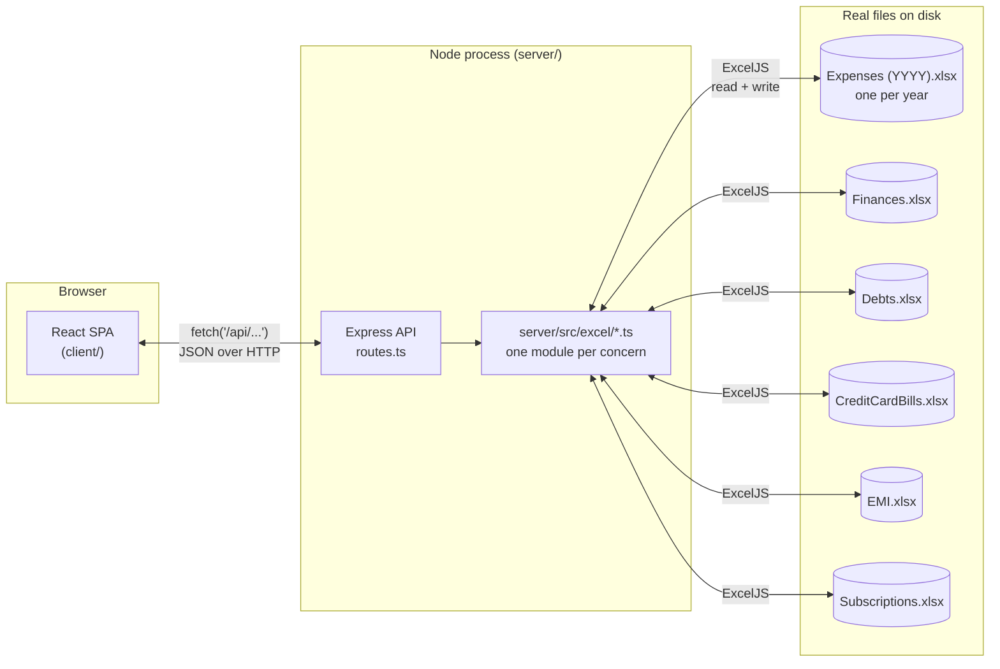

# Architecture

This is the technical reference for how Ledger is built — module map, data
flow, and the design principles that recur across every feature. For *what*
each tab does and *why* it works the way it does domain-wise (category
colors, EMI decay, credit card settlement, etc.), see [README.md](README.md)
instead — this document is about the system's shape, not its feature history.

## System overview



**There is no database.** The `.xlsx` files are the entire persistence layer
— opened, mutated, and saved directly via [ExcelJS](https://github.com/exceljs/exceljs)
on every read and write. This is a deliberate constraint, not a stopgap: the
files predate the app (some since 2018), need to stay fully readable/editable
in Excel by hand, and the whole point of the project is to give that existing
data a better front end without migrating it anywhere.

## Request lifecycle

1. A component calls a typed function from `client/src/api.ts` (e.g.
   `getEmis()`, `setMonthBills(...)`) — this is the *only* place the client
   knows about HTTP; components never call `fetch` directly.
2. That hits an Express route in `server/src/routes.ts`, which does light
   input coercion (`Number(...)`, `String(...)`, null-handling) and calls
   straight into the matching `server/src/excel/*.ts` module — routes.ts has
   no business logic of its own.
3. The Excel module opens the relevant workbook (creating it with headers if
   it doesn't exist yet), reads or mutates rows via ExcelJS, and — for
   writes — saves through `workbookIO.ts`'s shared safe-write path (below).
4. The response is plain JSON; errors are a `LedgerError(message, status)`
   thrown from anywhere in the excel layer and caught by a single Express
   error-handling middleware at the bottom of `routes.ts`.

There's no ORM, no query builder, no schema migrations — each module reads
the whole relevant sheet into memory, works with it as plain arrays/objects,
and writes the whole workbook back out.

## Backend module map (`server/src/excel/`)

| Module | Owns | Responsibility |
|---|---|---|
| `workbookIO.ts` | — | Shared safe write path (see below) + `DB_DIR` resolution. Every other module imports `saveWorkbook`/`LedgerError`/`DB_DIR` from here — nothing else touches `fs`/`ExcelJS.writeFile` directly. |
| `dateMath.ts` | — | Shared month/day arithmetic (`addMonths`, `addYears`, `clampDay`, `parseDate`/`formatDate`, `startOfDay`) used by EMI's decay and Subscriptions' renewal-advance. Local-midnight `Date`s throughout, deliberately avoiding UTC to sidestep timezone off-by-one bugs. |
| `categoryColors.ts` | — | The category ↔ ARGB fill-color map for Expenses rows (category is encoded as cell fill color, not a column). |
| `ledger.ts` | `Expenses (YYYY).xlsx` | Expense CRUD + reordering (`listMonth`, `appendEntry`, `updateEntry`, `deleteEntry`, `moveEntry`) and `yearSummary` (category totals per month for the dashboard chart). One workbook per year, one sheet per month. |
| `finances.ts` | `Finances.xlsx` | Salary/Other Income/Current-Savings-breakdown per month; derives Balance, Cumulative, Minimum Savings, Money Earned/Spent. |
| `debts.ts` | `Debts.xlsx` | Flat who-owes-whom list, signed amounts. |
| `creditCardBills.ts` | `CreditCardBills.xlsx` | Per-card bill entries per month (due/paid/dueDate/settled), stored as a JSON array in one cell per month-row (card count isn't fixed). |
| `emi.ts` | `EMI.xlsx` | Loan snapshots with auto-decay (`remainingAsOf` + `asOfDate` anchor, projected forward to "now" on every read, never stored as a running total) and payment recording. |
| `subscriptions.ts` | `Subscriptions.xlsx` | Recurring subscriptions with an auto-advancing `nextExpiry` (never written back — always derived fresh). |
| `overview.ts` | *(none — read-only)* | Cross-module aggregation for the Dashboard's Net Worth + Upcoming widget. Calls into every module above via `Promise.all`, never writes anywhere itself. |

Each concern owns exactly one workbook and is the only module that ever
writes to it — see **Per-concern isolation** below.

## Design principles

These aren't incidental — they're decisions that shaped nearly every feature
built on top of them, and any new module should follow the same shape.

### 1. Per-concern write-path isolation

Every tab's data lives in its own `.xlsx` file, owned by exactly one module.
A bug in, say, `emi.ts`'s write path can structurally never corrupt
`Debts.xlsx`, because `emi.ts` never opens it. `overview.ts` is the one
deliberate exception to "one module per file" — it reads across all of them
for the Dashboard, but it has no workbook of its own and no write function at
all, so the isolation guarantee for the other six is untouched.

### 2. Safe writes (`workbookIO.ts`)

Every write goes through `saveWorkbook(workbook, filePath)`:

1. **Backup once per process run** — before the *first* write to a given file
   in a server run, it's copied to `<DB_DIR>/.backups/<file>.<ISO
   timestamp>.xlsx`. Cheap insurance against a bad edit, given this is
   irreplaceable financial data with no other backup mechanism.
2. **Write to a temp file, then rename over the original** — never writes
   in place, so a crash mid-write can't leave a truncated/corrupt file.
3. **Locked-file detection** — if the file is open in Excel (rename fails),
   this surfaces as a clear `LedgerError` ("close it and try again"), not a
   raw stack trace.

### 3. Computed, never stored, derived values

Anything that can drift out of sync with reality if hand-maintained is
computed fresh on every read instead of written back to the sheet:

- EMI `remaining` — decayed from `remainingAsOf`/`asOfDate` forward to "now",
  one `emiAmount` per due day that's passed. The *stored* fields are just the
  last real snapshot; `remaining` itself is never persisted.
- Subscriptions' `nextExpiry` — advances the stored `expiryAnchor` forward by
  whole cycles until it's on/after today, computed fresh every time.
- The entire Dashboard Overview (Net Worth, Upcoming) — pure aggregation at
  request time, nothing cached or precomputed.

This trades a small amount of compute (all cheap in-memory arithmetic over a
handful of rows) for a correctness guarantee: the numbers can never be stale,
because there's no stale copy to begin with.

### 4. Dynamic cross-referencing over hardcoded lists

Where one module's data needs to reference another's (e.g. excluding an EMI
from Upcoming because it's already billed through a specific credit card),
the matching is done by cross-referencing the *live* data each request — a
`Set` built from whichever card names actually appear in that month's Credit
Card Bills — rather than a hardcoded name list. A newly added or renamed card
is picked up automatically on the next request, with no code change.

### 5. Excel-native storage, not a serialization format bolted on

Where the app's own domain rows don't map to their own dedicated Excel
columns cleanly, ExcelJS is used to preserve the *actual* pre-existing
convention — category is a cell's fill color (not a text column), because
that's how the file already encoded it by hand since 2018. Newer data that
has no pre-existing convention (e.g. a card's per-month bill list, since the
number of cards isn't fixed) is stored as a JSON array in a single cell
rather than inventing a variable-width column layout.

## API surface

All routes are mounted under `/api` (`server/src/index.ts`). No auth — this
is a local/Tailscale-only single-user tool.

| Method | Path | Module fn |
|---|---|---|
| GET | `/categories` | — (static list) |
| GET | `/months/:year/:month` | `ledger.listMonth` |
| GET | `/summary/:year` | `ledger.yearSummary` |
| POST | `/entries` | `ledger.appendEntry` |
| PUT | `/entries/:year/:month/:row` | `ledger.updateEntry` |
| DELETE | `/entries/:year/:month/:row` | `ledger.deleteEntry` |
| PATCH | `/entries/:year/:month/:row/move` | `ledger.moveEntry` |
| GET | `/finance/:year/:month` | `finances.getMonthIncome` |
| PUT | `/finance/:year/:month` | `finances.setMonthIncome` |
| GET | `/finance-summary/:year` | `finances.financeSummary` |
| GET | `/debts` | `debts.listDebts` |
| POST | `/debts` | `debts.addDebt` |
| PUT | `/debts/:row` | `debts.updateDebt` |
| DELETE | `/debts/:row` | `debts.deleteDebt` |
| GET | `/credit-card-bills/:year/:month` | `creditCardBills.getMonthBills` |
| PUT | `/credit-card-bills/:year/:month` | `creditCardBills.setMonthBills` |
| GET | `/credit-card-bills-summary/:year` | `creditCardBills.yearBillsSummary` |
| GET | `/emi` | `emi.listEmis` |
| POST | `/emi` | `emi.addEmi` |
| PUT | `/emi/:row` | `emi.updateEmi` |
| DELETE | `/emi/:row` | `emi.deleteEmi` |
| PATCH | `/emi/:row/pay` | `emi.recordEmiPayment` |
| GET | `/subscriptions` | `subscriptions.listSubscriptions` |
| POST | `/subscriptions` | `subscriptions.addSubscription` |
| PUT | `/subscriptions/:row` | `subscriptions.updateSubscription` |
| DELETE | `/subscriptions/:row` | `subscriptions.deleteSubscription` |
| GET | `/overview` | `overview.dashboardOverview` |

Rows are addressed by their real 1-indexed Excel row number (`:row`) rather
than a synthetic ID — there's no ID column anywhere in these sheets, and the
row number is already the natural, stable-within-a-session identity ExcelJS
gives every entry.

## Frontend architecture (`client/src/`)

- **No router, no global state library.** `App.tsx` holds a single `tab:
  Tab` string in `useState` and conditionally renders one top-level component
  per tab — switching tabs fully unmounts the previous one. This is
  intentional: every tab is either a self-contained flat list (Debts, EMI,
  Subscriptions — fetch-on-mount, no shared state needed) or month/year-
  scoped (Expenses, Finances, Credit Cards — `year`/`month` live in `App.tsx`
  and are passed down as props, since `MonthYearPicker` needs to drive all
  three).
- **`api.ts`** is the single boundary to the backend — every exported
  function does one `fetch` call and returns a typed result. Components never
  construct a URL or call `fetch` themselves.
- **Component shape**: most tabs follow the same three-piece pattern —
  `<Tab>.tsx` (fetch + state + form), `<Item>Row.tsx` (display), `Edit<Item>Row.tsx`
  (inline edit, swapped in for the row being edited). Shared row-action
  affordances (Edit/Delete/Copy/etc.) go through `OverflowMenu.tsx`, a
  generic `items: {label, onClick, ...}[]` menu, not a bespoke dropdown per
  tab.
- **CSS**: one file per component, co-located (e.g. `Debts.css` next to
  `Debts.tsx`), imported directly (Vite bundles them into one global
  stylesheet, so anything genuinely shared lives in `shared.css` instead of
  being duplicated or accidentally leaking from one component into another).
  Theming is CSS custom properties (`--bg`, `--card-bg`, `--text`,
  `--text-h`, `--border`, `--success`, `--danger`, …) redefined per theme in
  `index.css`; `ThemeToggle.tsx` sets `data-theme` on `<html>` and persists
  the choice to `localStorage`, falling back to `prefers-color-scheme` until
  an explicit choice is made.
- **Dashboard** (`Dashboard.tsx` + `DashboardOverview.tsx`) is the default
  tab and the only place that reads across multiple concerns — via the one
  `/api/overview` aggregation endpoint, not multiple parallel fetches to
  each tab's own API.

## Testing

- **`server/test/*.test.ts` (vitest)** — one file per excel module, each
  spinning up a scratch temp directory (`LEDGER_DB_DIR` env override, read
  *before* any module's top-level `DB_DIR` evaluates, so imports are dynamic
  `await import(...)` rather than static) so tests never touch real data.
  Fast, no browser.
- **`e2e/regression.ts` (Playwright, plain script)** — builds a full scratch
  data directory, boots the real dev server against it, and drives an actual
  browser through the entire app end to end: every tab's add/edit/delete,
  cross-tab flows (Dashboard Overview combining Finances/Debts/EMI/Credit
  Cards), theme persistence. Not the `@playwright/test` runner — a plain
  script was simpler than wiring up its `webServer` orchestration for one
  script.

See the **Testing** section of `README.md` for exact commands and current
coverage detail.

## Deployment

`npm run build` (`tsc` for both packages + `vite build` for the client)
produces `client/dist/` and `server/dist/`; `npm start` then runs the built
server, which serves the client's static build itself (`server/src/index.ts`)
— a single port, no separate dev servers, no HMR. For always-on personal use
this runs as a Windows **Scheduled Task** ("Ledger"), reachable over
**Tailscale** as well as `localhost`. See `README.md`'s **Remote access** and
**Running** sections for the exact setup.

## Directory structure

```
server/
  src/
    excel/          One module per workbook (+ workbookIO.ts, dateMath.ts,
                     categoryColors.ts as shared infrastructure)
    routes.ts        Express route → excel-module wiring, input coercion only
    index.ts         App bootstrap, static-serving for the production build
  test/              vitest suite, one file per excel module
client/
  src/
    api.ts           Every backend call, typed — the only fetch() boundary
    App.tsx           Tab state + top-level layout
    components/        One directory-flat set of .tsx + co-located .css
    format.ts, id.ts, categoryColors.ts, constants.ts (small shared
      utilities: rupee formatting, client-generated row keys, the category
      swatch map mirrored from the server, EARLIEST_YEAR, etc.)
e2e/
  regression.ts      Full-stack Playwright script (see Testing above)
scripts/
  kill-ports.js         Frees dev ports 4000/5173 before/on demand
  run-server.bat,
  run-server-hidden.vbs  Scheduled Task launch chain for always-on use
                         (see README's Remote access section) — both
                         self-locate relative to their own file, no
                         hardcoded path
docs/
  screenshots/       Images embedded in README.md
```
