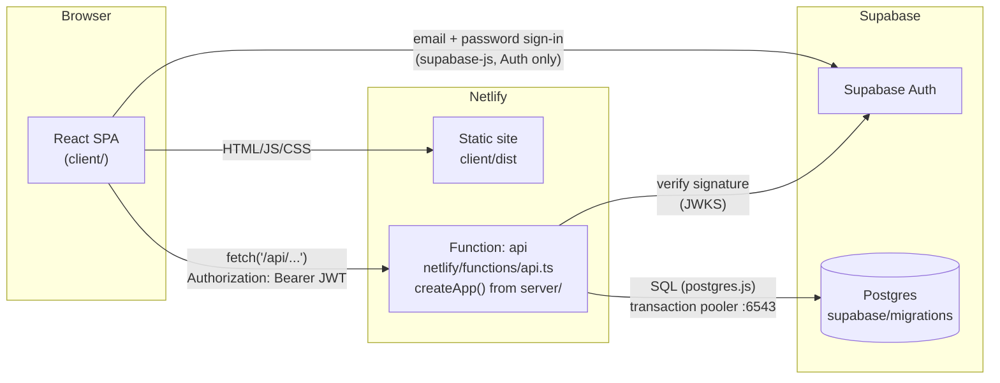

# Architecture

This is the technical reference for how Ledger's hosted edition is built:
module map, request lifecycle, and the design principles that recur across
every feature. For *what* each tab does and *why* domain-wise (category
colors, EMI decay, credit card settlement, etc.), see [README.md](README.md).
The design documents go deeper and are authoritative where they overlap
with this file:

- [HLD](docs/architecture/HLD.md): context, goals, system topology, quality
  attributes.
- [LLD](docs/architecture/LLD.md): schema (§2), transactions (§4), the API
  contract (§5), authentication (§6), Netlify packaging (§7), configuration
  (§9), testing (§10), errors and logging (§11).
- [ADRs](docs/adr/README.md): why each of those choices was made.
- [docs/DEPLOY.md](docs/DEPLOY.md): standing up a copy.

## System overview


```mermaid
flowchart LR
    subgraph Browser
        UI["React SPA<br/>(client/)"]
    end
    subgraph Netlify
        CDN["Static site<br/>client/dist"]
        FN["Function: api<br/>netlify/functions/api.ts<br/>createApp() from server/"]
    end
    subgraph Supabase
        AUTH["Supabase Auth"]
        PG[("Postgres<br/>supabase/migrations")]
    end

    UI -- "HTML/JS/CSS" --> CDN
    UI -- "email + password sign-in<br/>(supabase-js, Auth only)" --> AUTH
    UI -- "fetch('/api/...')<br/>Authorization: Bearer JWT" --> FN
    FN -- "verify signature<br/>(JWKS)" --> AUTH
    FN -- "SQL (postgres.js)<br/>transaction pooler :6543" --> PG
```

Each copy is one Netlify site plus one Supabase project with a single owner
([ADR-0001](docs/adr/0001-host-on-netlify-and-supabase.md),
[ADR-0002](docs/adr/0002-self-host-single-owner.md)). The browser talks to
Supabase only to sign in. Every read and write goes through the app's own
API, which is the only thing that connects to the database. Row Level
Security is on with no policies on every table, so Supabase's auto-generated
data API exposes nothing.

Locally, the same `createApp()` runs as a plain Express server
(`server/src/index.ts`) against the Supabase CLI's Docker stack, with Vite
serving the client.

## Request lifecycle

1. A component calls a typed function from `client/src/api.ts` (e.g.
   `getEmis()`, `setMonthBills(...)`). This is the *only* place the client
   knows about HTTP. Its shared `request()` reads the current Supabase
   session on every call (refreshing the access token near expiry) and adds
   `Authorization: Bearer <access_token>`.
2. Netlify rewrites `/api/*` to the `api` function (`netlify.toml`), which is
   `serverless-http` around `createApp()` (`server/src/app.ts`). Locally,
   Vite's dev proxy forwards `/api` to the Express server instead.
3. `createApp` runs, in order: a one-line request log (method, path, status,
   duration; never bodies, headers or query strings), the owner check
   (`auth.ts`: JWT verified against the project's JWKS, email must equal
   `OWNER_EMAIL`, else 401/403), the section gate (`modules.ts`: a disabled
   module's route is a 404), the JSON body parser, then `routes.ts`.
4. `routes.ts` does light input coercion and calls straight into the
   matching `server/src/store/*.ts` function. It has no business logic.
5. The store module validates input (`store/validate.ts`), runs its SQL,
   and for any multi-statement write wraps it in `withTransaction`
   (`db/tx.ts`). Calculations come from the pure `server/src/domain/*`
   functions.
6. The response is plain JSON. Errors are a `LedgerError(message, status)`
   thrown from anywhere below the routes, turned into `{ error }` by one
   error handler in `app.ts`. Database refusals that slip past validation
   are mapped to a 400/409 by `dbErrors.ts`; anything else is a generic 500
   with the details logged, never returned.

`createApp` reads its configuration once, at startup, and throws on a bad
one (missing `SUPABASE_URL`/`OWNER_EMAIL`, `AUTH_DISABLED` where it isn't
allowed, an unknown `ENABLED_MODULES` name), so a misconfigured deploy fails
loudly instead of per request.

## Backend module map (`server/src/`)

| Module | Responsibility |
|---|---|
| `app.ts` | `createApp({ basePath })`: request log, auth, section gate, body parser, router, error handler. Shared by the local server and the function. |
| `index.ts` | Local entry point: `createApp()` + `app.listen(PORT)`, plus serving `client/dist` when run from a build (`npm start`). Not used on Netlify. |
| `routes.ts` | The route table ([LLD §5](docs/architecture/LLD.md#5-api-contract)), input coercion only. |
| `auth.ts` | `readAuthConfig` (startup checks) and `requireOwner` (bearer JWT, `ES256`/`RS256`/`EdDSA` only, `iss`/`aud`/`exp` checks, owner email). |
| `modules.ts` | `ENABLED_MODULES` parsing, the route → module map, the disabled-module 404. |
| `errors.ts`, `dbErrors.ts` | `LedgerError`; SQLSTATE → client error mapping. |
| `db/client.ts` | The postgres.js client: lazy, one connection per process or function instance, `prepare: false` for the transaction pooler, and type parsers keeping `date` as `YYYY-MM-DD` strings and `numeric`/`int8` as numbers. |
| `db/tx.ts` | `withTransaction(fn)`. |
| `store/ledger.ts` | Expenses: `listMonth`, `appendEntry`, `updateEntry`, `deleteEntry`, `moveEntry`, `yearSummary` (category totals per month), `isMonthLocked`/`setMonthLocked`. Every write checks the month lock inside its transaction under a per-month advisory lock. |
| `store/categories.ts` | The `categories` table, read-or-create: an empty table is filled with `DEFAULT_CATEGORIES` on first read. |
| `store/finances.ts` | Salary/Other Income/savings per month; `financeSummary` (Balance, Cumulative, Minimum Savings, Money Earned/Spent) and `previousSavings`. |
| `store/debts.ts` | Who-owes-whom list, signed amounts. |
| `store/creditCardBills.ts` | Per-card bills per month (due/paid/dueDate/settled), saved as a whole month at a time. |
| `store/emi.ts` | Loan snapshots, payments, and `emiMonthlyProjection` for the Dashboard chart. |
| `store/subscriptions.ts` | Recurring subscriptions. |
| `store/overview.ts` | Read-only aggregation for the Dashboard (Net Worth, Upcoming, EMI-free date), reading only enabled modules' stores. Never writes. |
| `store/validate.ts` | Shared input checks matching the schema's bounds. |
| `domain/*.ts` | Pure calculations, no I/O: `dateMath`, `emiMath`, `subscriptionMath`, `financeMath`, `creditCardMath`, `categoryColors`, and `today.ts` (`todayInAppZone`). |

## Design principles

These shaped nearly every feature, and new code should follow them.

### 1. Calculations are pure; storage is separate

Everything that computes (EMI decay, payoff and foreclosure math, renewal
advance, finance series, card totals, the overview's rules) lives in
`server/src/domain/` as pure functions over plain values, with "today"
passed in. SQL and I/O live only in `server/src/store/`. That kept behaviour
identical through the move from Excel to Postgres (the domain code moved
unchanged and the existing tests became the parity contract), and it's what
still lets calculation and UI changes cherry-pick between this edition and
the `personal` (Excel) edition.

### 2. Every write is one transaction

A write that touches more than one row runs inside `withTransaction`
([LLD §4.3](docs/architecture/LLD.md#43-transactions)): an expense write
takes a per-month advisory lock, checks the month lock, then writes, so two
devices writing the same month queue instead of interleaving, and a
lock toggle can't race a write. Reordering relies on a deferred unique
constraint on `(year, month, position)`. Any throw rolls everything back.

### 3. The database enforces the same rules as the API

Constraints mirror API validation (positive amounts, months 1–12, due days
1–31, non-blank names), so bad data can't get in even through a bug.
`store/validate.ts` checks the same bounds first, so the user gets a
specific message; `dbErrors.ts` turns anything that still reaches the
database into a generic 400/409 without echoing the input. Schema changes
happen only through new files in `supabase/migrations/`.

### 4. Computed, never stored, derived values

Anything that would drift if hand-maintained is computed on every read:

- EMI `remaining`: decayed from `remaining_as_of`/`as_of_date` to today, one
  `emiAmount` per due day passed. Only the last real snapshot is stored.
- Subscriptions' `nextExpiry`: the stored `expiry_anchor` advanced by whole
  cycles until it's on or after today.
- Finances' Balance, Cumulative, Minimum Savings and running totals.
- The whole Dashboard overview (Net Worth, Upcoming).

The numbers can never be stale, because there's no stale copy.

### 5. "Today" is explicit

The function runs in UTC, so every "today" comes from `todayInAppZone()`
(`APP_TIMEZONE`, default `Asia/Kolkata`) or an injected `today` parameter,
never a bare `new Date()`
([ADR-0005](docs/adr/0005-explicit-app-timezone.md)). Calendar dates are
`date` columns read back as `YYYY-MM-DD` strings, never JS `Date`s built at
UTC midnight.

### 6. Dynamic cross-referencing over hardcoded lists

Where one module's data references another's (e.g. leaving an EMI out of
Upcoming because it's already billed through a credit card), the match is
made against the live data on each request (a `Set` of whichever card
names appear in that month's bills), not a hardcoded list, so a new card is
picked up automatically.

### 7. One codebase, sections chosen per deployment

`ENABLED_MODULES` turns sections off without forking the code or the
schema ([ADR-0006](docs/adr/0006-enabled-modules-per-deployment.md)). Every
table exists in every copy; the setting only changes which routes are
served and what the overview reads. A new route must be added to
`ROUTE_MODULES` or `ALWAYS_ON_ROUTES` in `modules.ts`, or the API test
fails.

## API surface

The route table, request bodies and response shapes are byte-compatible
with the Excel edition; [LLD §5](docs/architecture/LLD.md#5-api-contract)
has the full table. The differences:

- Every route is behind the owner check: 401 without a valid token, 403 for
  any account other than `OWNER_EMAIL`.
- `GET /api/config` returns `{ "modules": [...] }`, the enabled sections.
  `/api/categories`, `/api/config` and `/api/overview` are always on; a
  disabled section's routes are a 404.
- Every `row` field and `:row` parameter is a database id: an opaque,
  stable integer, no longer a sheet row number. Deleting a row doesn't
  change other rows' ids.
- The API is mounted at `/api` and, in the function, also at
  `/.netlify/functions/api` ([LLD §7](docs/architecture/LLD.md#7-netlify-packaging)).

## Frontend architecture (`client/src/`)

- **Auth** (`auth/`): `supabase.ts` creates the Supabase client from
  `VITE_SUPABASE_URL`/`VITE_SUPABASE_ANON_KEY`, used for Auth only.
  `session.ts`'s `useSession()` follows the session; `App` renders only
  `<SignIn/>` until there is one. A 401 from the API signs out locally and
  shows a notice; a 403 on `GET /api/config` shows the "not allowed" screen.
  If the build lacks the two variables, the sign-in screen says so.
  [LLD §6](docs/architecture/LLD.md#6-authentication) has the details.
- **Sections**: after sign-in, `App` loads `GET /api/config` and categories
  before rendering any tab, then shows the Dashboard plus only the enabled
  tabs. The Dashboard renders each part only when its section is on (and
  each stat card only when its figure isn't `null`). No client rebuild is
  needed to change sections.
- **No router, no global state library.** `App.tsx` holds a single `tab`
  string in `useState` and renders one top-level component per tab;
  switching tabs unmounts the previous one. Every tab is either a
  self-contained flat list (Debts, EMI, Subscriptions: fetch on mount) or
  month/year-scoped (Expenses, Finances, Credit Cards: `year`/`month` live in
  `App.tsx` and are passed down, since `MonthYearPicker` drives all three).
- **`api.ts`** is the single boundary to the backend: every exported
  function makes one request and returns a typed result. A non-2xx response
  throws an `ApiError` carrying its `status`. Components never build a URL
  or call `fetch` themselves.
- **Component shape**: most tabs follow the same pattern: `<Tab>.tsx`
  (fetch + state + form), `<Item>Row.tsx` (display), `Edit<Item>Row.tsx`
  (inline edit, swapped in for the row being edited). Row actions go through
  `OverflowMenu.tsx`, a generic `items: {label, onClick, ...}[]` menu, and
  confirmations through the in-app `Dialog.tsx`. A signed amount (Debts, the
  Finances savings delta) goes through `SignedAmountInput.tsx`, which splits
  sign (a two-button toggle) from magnitude, since a phone's numeric keypad
  has no "-" key.
- **CSS**: one file per component, co-located and imported directly (Vite
  bundles them into one stylesheet, so anything shared lives in
  `shared.css`). Theming is CSS custom properties (`--bg`, `--card-bg`,
  `--text`, `--text-h`, `--border`, `--success`, `--danger`, …) redefined
  per theme in `index.css`; `ThemeToggle.tsx` sets `data-theme` on `<html>`
  and persists the choice to `localStorage`, falling back to
  `prefers-color-scheme` until an explicit choice is made.
- **Dashboard** (`Dashboard.tsx` + `DashboardOverview.tsx`) is the default
  tab and the only place that reads across concerns, through the one
  `/api/overview` endpoint, not parallel fetches to each tab's API.
- **Code-splitting**: every tab except Dashboard is `React.lazy`-loaded
  behind a shared `<Suspense>` fallback. Dashboard stays eager since it's
  the default view. Most of the main chunk is `recharts` and React itself,
  which the default view needs anyway.
- **Reordering** (`RecentEntries.tsx`/`EntryRow.tsx`) is driven by Pointer
  Events, not the HTML5 Drag and Drop API, which never fires on touch input.
  The handle (`aria-hidden`) listens for `pointerdown`, then tracks
  `pointermove`/`pointerup` on `window` and hit-tests
  `document.elementFromPoint` against each row's `data-row` attribute;
  `touch-action: none` stops the browser's scroll gesture from competing.
  The overflow menu's **Move up**/**Move down** call the same `moveEntry`
  with an adjacent entry's id. Credit Cards reuses the drag mechanism
  client-side only, since the saved array's order is what persists.
- **Sorting** (Debts, EMI, Subscriptions) follows one shape: a `SortField`
  union, a `SORT_OPTIONS: {field, label}[]` array driving a row of buttons,
  and clicking the active field again flips `SortDir`.
- **`MonthLockToggle.tsx`** shows and toggles the month's lock
  (`GET`/`PUT /api/months/:year/:month/lock`). `App.tsx` passes the
  `locked` flag down to disable the Add Expense form (one
  `<fieldset disabled>`) and hide `RecentEntries`' drag handle and overflow
  menu, surfacing the server's 403 ahead of time.

## Testing

All of it runs against the local Supabase stack in Docker; nothing touches
a hosted project. [LLD §10](docs/architecture/LLD.md#10-testing) has the
full coverage list, and README's **Testing** section the commands.

- **`server/test/*.test.ts` (vitest)**: domain unit tests with no database;
  store tests against the local Postgres (each file truncates the tables it
  touches; `fileParallelism: false` since the files share one database;
  `dbHelpers.ts` refuses any non-local host); schema constraint tests;
  `api.test.ts` with supertest on `createApp()` and a test-generated ES256
  key pair injected as the JWKS.
- **`e2e/regression.ts` and `e2e/expensesOnly.ts` (Playwright, plain
  scripts)**: reset the local database (`e2e/localDb.ts`, local hosts only),
  start the dev server on this checkout's ports (`e2e/devServer.ts`), sign
  in through the real form as the seeded owner (`e2e/auth.ts`, which refuses
  a non-local Supabase URL or `AUTH_DISABLED`), and drive the whole app;
  the second script runs with `ENABLED_MODULES=expenses`.
- **`e2e/screenshots.ts`**: regenerates the Dashboard screenshots from a
  fixed fictional dataset with the same isolation, asserting every tab is
  empty before writing anything.

## Deployment

- **Hosted:** Netlify builds the client (`npm ci && npm run build -w client`,
  publishing `client/dist`) and bundles `netlify/functions/api.ts` with
  esbuild, which resolves the server's `.js` imports to its `.ts` sources
  and inlines every dependency. The schema is applied to the Supabase
  project with `npx supabase db push`. All configuration is environment
  variables ([LLD §9](docs/architecture/LLD.md#9-configuration)); the
  `VITE_*` ones are build-time, the rest are read by the function at
  startup. Step by step: [docs/DEPLOY.md](docs/DEPLOY.md).
- **Local:** `npm run dev` runs the server (`tsx watch`) and Vite with hot
  reload. `npm run build` + `npm start` serve the built client and API from
  one process on `PORT`.

**Ports are overridable, not hardcoded**, so a second checkout (a different
clone, branch, or `git worktree`) can run at the same time as another. The
server reads `PORT` (default 4000); `client/vite.config.ts` reads
`VITE_DEV_PORT` (default 5173) and `VITE_API_PROXY_TARGET` (default
`http://localhost:4000`, must match the paired server's `PORT`) via Vite's
`loadEnv`. `scripts/kill-ports.js` reads the same two ports from
`server/.env`/`client/.env` (a small dependency-free parser, since it runs
directly from `predev`/`prestart`). That matters because it force-kills
whatever is listening on those ports before every `dev`/`start`, so an
unaware second checkout would otherwise kill the first one's server. Both
`.env` files are gitignored and checkout-local.

## Directory structure

```
client/
  src/
    api.ts            Every backend call, typed, with the bearer token: the only fetch() boundary
    App.tsx           Session gate, config load, tab state, top-level layout
    auth/             supabase.ts, session.ts, SignIn.tsx, SignOutButton.tsx
    components/       One flat set of .tsx + co-located .css
    format.ts, id.ts, constants.ts   Small shared utilities
server/
  src/
    app.ts, index.ts, routes.ts, auth.ts, modules.ts, errors.ts, dbErrors.ts
    db/               client.ts, tx.ts
    store/            One module per concern (SQL), plus validate.ts
    domain/           Pure calculations
  test/               vitest suites + dbHelpers.ts / ledgerSeed.ts
netlify/
  functions/api.ts    The API as one Netlify Function
  tsconfig.json       Typecheck-only config for the function
supabase/
  config.toml         Local stack settings
  migrations/         The schema, applied in order
  seed.sql            Local only: default categories + the test owner
e2e/
  regression.ts, expensesOnly.ts, screenshots.ts
  devServer.ts, auth.ts, localDb.ts   Shared helpers
scripts/
  kill-ports.js       Frees this checkout's dev ports (PORT / VITE_DEV_PORT)
  import-xlsx.ts      One-time import of an Excel-edition data folder (LLD §8)
  legacy-excel/       The Excel edition's readers, plus importer.ts (the import itself)
  run-server.bat, run-server-hidden.vbs
                      Left over from the Excel edition's Windows Scheduled Task; not used here
docs/
  DEPLOY.md           Standing up a copy on Netlify + Supabase
  architecture/       HLD.md, LLD.md
  adr/                Decision records
  screenshots/        Images embedded in README.md
netlify.toml          Build, function and redirect settings
```
