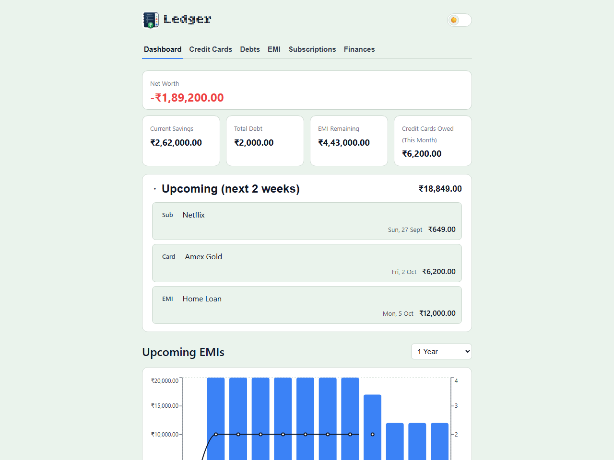
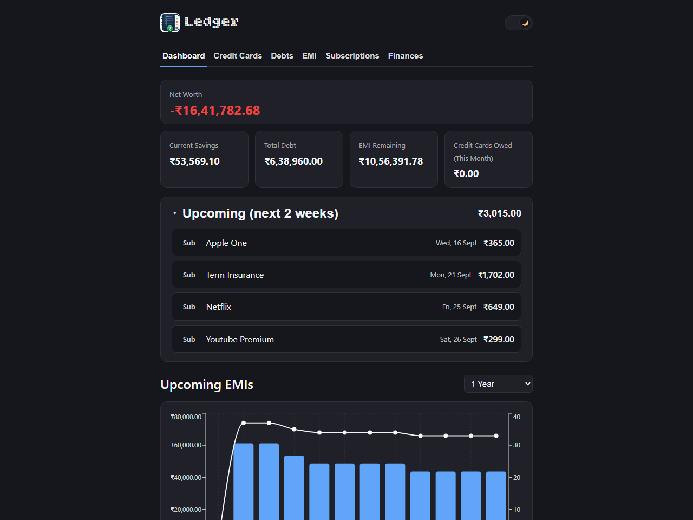
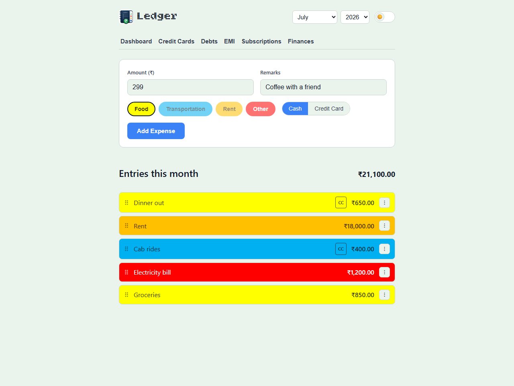
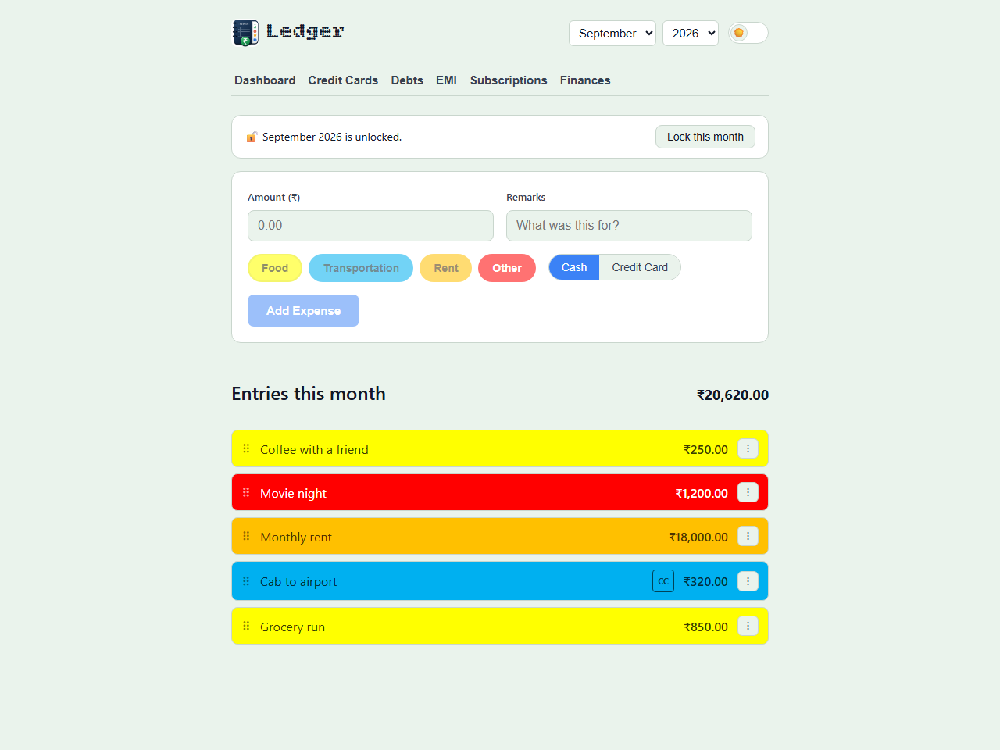
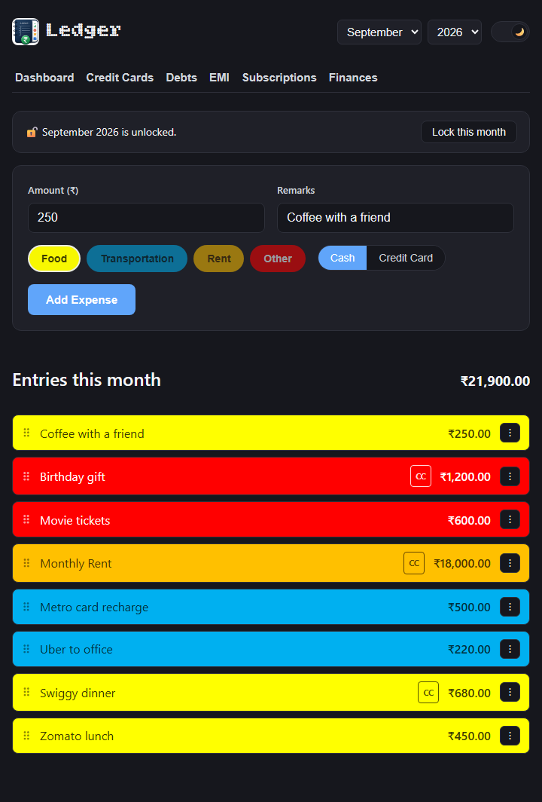
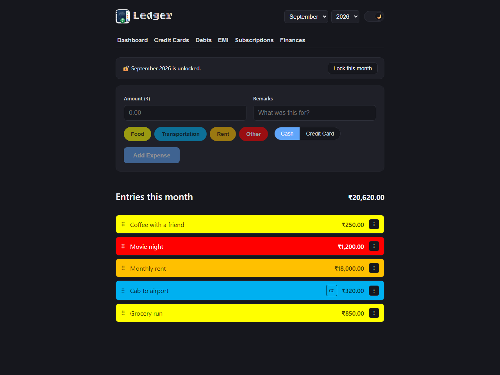

# Ledger

A local web app for logging personal expenses directly into the existing
`Expenses (YYYY).xlsx` workbooks — one sheet per month, one workbook per year —
that have been used to track spending since 2018. There is no database; the
Excel files themselves are the source of truth, and the app reads and writes
them in place.

For the technical architecture (module map, request lifecycle, design
principles, API surface) see [ARCHITECTURE.md](ARCHITECTURE.md). This file
covers what each part of the app does and why, domain-wise.

- [Why this exists](#why-this-exists)
- [See it in action](#see-it-in-action)
- [How it works](#how-it-works)
- [Project layout](#project-layout)
- [Setup](#setup)
- [Running](#running)
- [Remote access (Tailscale)](#remote-access-tailscale) — Windows-only, optional
- [Testing](#testing)
- [Notes / gotchas](#notes--gotchas)
- [History: retiring Expense Summary.xlsm](#history-retiring-expense-summaryxlsm)

## Why this exists

I'd tracked every expense by hand in Excel since 2018 — one workbook per
year, one sheet per month, each row's category marked by literally coloring
the cell (yellow for food, blue for transport, and so on), plus a manual note
for anything paid by credit card instead of cash. It worked, but typing a new
row into Excel on my phone every time I bought something was clunky, and
years of categorized history meant switching to Mint/YNAB/some other
budgeting app wasn't really an option without either losing that history or
spending a weekend re-entering eight years of data by hand.

So instead of replacing the spreadsheets, I built a small web app that reads
and writes the *same* `.xlsx` files directly — no database, no import step,
no migration. The Excel files stay the actual source of truth, still fully
open-able and editable by hand at any time; the app is just a nicer front
door to them, reachable from my phone. Once the core "add an expense" flow
worked, the same idea extended naturally to everything else I used to track
by hand in a second, more fragile macro-enabled workbook — credit card
bills, loans/EMIs, subscriptions, debts, and monthly savings — each getting
its own small owned Excel file and its own tab in the app, computed
automatically wherever the old sheet required updating a number by hand
(a loan's remaining balance, a subscription's next renewal date, whether a
month's savings target was hit).

If you've got years of financial history sitting in spreadsheets and want a
better way to add to it *without* giving up ownership of the actual data,
this is the shape that approach can take: treat the file the user already
trusts as the real database, and build the smallest possible app around it.
[ARCHITECTURE.md](ARCHITECTURE.md) covers how that's implemented in more
technical detail, including the constraints that fell out of taking "the
spreadsheet is the database, for real" seriously (no schema migrations, safe
concurrent-with-Excel writes, no cached/stale derived numbers).

## See it in action

*(Screenshots below use made-up sample data, not anyone's real finances.)*

**Dashboard** — Net Worth and an Upcoming list combining every EMI due date,
subscription renewal, and outstanding credit card bill in the next two
weeks, above a yearly spending chart. Supports light and dark themes:

| Light | Dark |
|---|---|
|  |  |

**Adding an expense** — pick a category by color (matching the same
convention the underlying spreadsheets already used), mark it cash or card,
and it's appended straight to the real `Expenses (YYYY).xlsx` file:

| | Filling out the form | Saved, showing in the month's list |
|---|---|---|
| Light |  |  |
| Dark |  |  |

## How it works

- Each month sheet has three columns: **Amount** (negative, ₹-formatted),
  **Remarks**, and an optional **CC** marker (blank = cash, `"CC"` = paid by
  credit card).
- **Category isn't a column — it's the row's cell fill color**, matching the
  scheme already used in the sheets:
  - Yellow (`FFFFFF00`) = Food
  - Blue (`FF00B0F0`) = Transportation
  - Orange (`FFFFC000`) = Rent
  - Red (`FFFF0000`) = Other / non-recurring
- There's no date column — rows are just chronological within a month sheet.
  New entries append to the bottom of the target month's sheet.
- The app only ever touches columns A–C. Anything else on a sheet (e.g. old
  odometer/mileage tracking columns) is left completely alone.
- Borders are preserved: the Amount/Remarks columns keep a thick outer box
  whose bottom edge always tracks whichever row is currently last, and the CC
  column keeps its own individually-boxed border on every row — but only on
  rows that are actually card transactions; a cash row's CC cell is left
  completely blank (no fill, no border), matching the sheets exactly.
  New/edited/deleted/reordered rows are formatted to match automatically.
- Amount is right-aligned and Remarks is left-aligned, both vertically
  centered, matching every existing row (ExcelJS otherwise defaults to bottom
  alignment for cells with no explicit alignment set).
- Copying, editing, deleting, and reordering are only available for the
  **current calendar month** in the UI (and blocked server-side for any
  protected sheet regardless). Copy/Edit/Delete live under a "⋮" menu on each
  entry. Deleting actually removes the row and shifts everything below it up,
  rather than just blanking it, so row numbers stay meaningful. Reordering
  (drag the ⠿ handle) similarly moves the row for real rather than just
  changing how it displays — driven by Pointer Events rather than the HTML5
  drag-and-drop API, since the latter never fires on touch (mobile Safari/
  Chrome), which is what made the handle silently do nothing on a phone. The
  "⋮" menu also has **Move up**/**Move down** entries doing the same
  adjacent-position swap, for when a keyboard is in use or the handle is
  otherwise inconvenient — the handle itself is `aria-hidden`, so this is the
  only reorder path a screen reader can reach. Copy adds a brand new entry
  with the same amount/remarks/category/card-status, appended at the end
  like any other new
  entry — never linked back to the original — so editing one afterward never
  touches the other.
- The app opens on the **Dashboard** tab by default. It shows a stacked bar
  chart of category totals per month for a selected year, computed live from
  the same ledger data (no separate storage) — a year selector independent of
  the Expenses view's month/year. Clicking any month's bar (even an empty one)
  jumps to Expenses with that month/year selected, so you can view an existing
  month or drop straight into adding a new entry. **Expenses has no button in
  the nav bar** — the Dashboard chart is the only way in, by design, since the
  Dashboard is meant to be the main view day to day. The rest of the nav bar
  is ordered Dashboard, Credit Cards, Debts, EMI (Equated Monthly
  Installment — the standard Indian-banking term for a fixed loan
  repayment), Subscriptions, Finances — matching the sheet order in the old
  `Expense Summary.xlsm` (see
  [History](#history-retiring-expense-summaryxlsm) below) rather than the
  order each tab happened to be built in. Below a ~600px viewport (a phone),
  "Credit Cards" and "Subscriptions" — the two longest labels — shorten to
  "CC Bills" and "Subs", and the nav's own spacing tightens slightly, so all
  six tabs still fit on one row instead of the last one wrapping to a second
  line. Verified by directly measuring rendered button/gap widths at 420px,
  not just eyeballed.
- The Dashboard also opens with an **overview widget** above the yearly
  chart: a **Net Worth** figure (Current Savings − Total Debt − EMI
  Remaining − this month's unpaid Credit Card bills, all pulled live from
  their own tabs) and an **Upcoming (next 2 weeks)** list combining every
  EMI due date, Subscription renewal, and outstanding Credit Card bill due
  in that window, sorted soonest-first. It's the one place that reads across
  every other tab — everything else stays a one-way read into that
  aggregation; no tab writes through it, so each module's own write-path
  isolation is untouched. Converting a purchase to EMI on one of the actual
  credit cards bills it through that card's own monthly bill, not
  separately — so an EMI whose Card/Bank name matches a card that also has
  its own Credit Card Bill entry that month is left out of the Upcoming list
  (it's already represented by that card's own line), while a standalone
  loan not billed through any card still shows normally. This is worked out
  dynamically against whichever names actually appear in Credit Card Bills,
  not a hardcoded list, so a newly added card is picked up automatically.
  Net Worth's EMI Remaining still counts every EMI's *full* balance
  regardless, including card-linked ones — excluding them there would
  understate real debt by everything beyond the current month's installment.
  The **Credit Cards Owed (This Month)** figure specifically means this
  month's total bill across every card minus whatever's already been paid
  toward it (floored at 0), for every card not marked **Settled** — it's a
  single-cycle number, not a running credit card balance, since credit cards
  don't carry a multi-month "remaining" the way EMIs do. A card checked off
  as Settled contributes exactly 0 here and is dropped from Upcoming
  entirely, regardless of its raw due/paid gap — added because payment apps
  like CRED routinely round a bill down by a rupee or two, and a card the
  user has actually paid off shouldn't still read as "owed" just because of
  that leftover. An EMI's Upcoming due date is computed from its own stored
  snapshot date, not just "today" — so clicking **Paid this month** (or
  **Record payment…**) correctly advances which cycle shows as upcoming
  next, rather than continuing to show the one just paid. The header also
  shows the total across every Upcoming item, so you know what's coming due
  at a glance without adding it up yourself — and since it lives in the
  header rather than the (foldable) list itself, it's still visible even
  when Upcoming is collapsed. On a phone-width screen the "(next 2 weeks)"
  part of the heading drops to just "Upcoming", so it doesn't crowd the
  total sharing the same row. Upcoming can get
  long, so its header is a fold/collapse toggle — defaults open (it's the
  actionable part of the dashboard), and remembers whichever state you last
  left it in (`localStorage`, same pattern as the theme toggle) so it stays
  collapsed across visits once you close it, e.g. to get to the yearly chart
  below it faster. Styled as its own card (matching `.dashboard-total`/
  `.chart-wrap` below it) with a title sized/weighted to match "Yearly
  Overview"'s `<h2>` exactly, so the two section headers read as the same
  level of the page; folds via an animated `grid-template-rows` 1fr↔0fr
  transition rather than an instant show/hide, so collapsing it visibly
  shrinks down to a single-line card instead of just disappearing. Each
  Upcoming row is itself clickable — a shortcut to go pay/settle it rather
  than hunting for it by hand: an EMI item jumps to the EMI tab, a
  Subscription item jumps to Subscriptions, and a Credit Card item jumps to
  Credit Cards *on the month that bill is actually due* (not whatever
  month happens to be selected already). EMI balances normally auto-decay
  on their own due day without any click needed, but this still matters for
  an early/manual payment made outside that automatic schedule — the same
  reason a standalone EMI item is worth clicking through to at all, even
  though its own tab would eventually reflect the payment regardless.
- The **Finances** tab tracks Salary, Other Income, and a Current
  Savings snapshot per month — entered through the app into a new
  `Finances.xlsx` that it owns entirely (originally kept separate from
  `Expense Summary.xlsm`, the old macro-enabled workbook this superseded —
  see [History](#history-retiring-expense-summaryxlsm) below). From those
  entries it computes:
  - **Balance** — last month's total income (salary + other income) minus
    this month's expenses. A month with no income on record counts as zero,
    so it shows as a real deficit rather than "unknown".
  - **Cumulative** — running sum of Balance since 2018.
  - **Minimum Savings** — `ceil(15% of this month's own salary + other income)`.
  - **Money Earned / Money Spent** — running totals of income / ledger
    expenses since 2018.
  - **Current Savings** — named scheme balances (PPF, NPS, APY, etc.),
    summed automatically into a total. Entry is delta-based, not absolute:
    each scheme shows its last known balance (carried forward from
    whichever month it was last touched) and you type a **+/− change** —
    a deposit or a withdrawal — and the app computes and stores the new
    absolute balance for you. For a scheme with no prior balance yet, the
    first amount you type simply becomes its starting balance (baseline
    zero). The underlying data is still a plain absolute balance per
    scheme per month — only entry is delta-based — so a scheme's real
    figure can always be corrected by typing whatever delta reconciles it
    to your actual passbook/statement, rather than drifting permanently out
    of sync the way a pure running-total ledger would. The set of schemes
    isn't fixed — add or remove one freely as your actual savings mix
    changes. Whichever month's breakdown was most recently entered carries
    forward across later months until you update it again, rather than
    resetting to blank.

  The Save button stays disabled until something on the form actually
  differs from what's on record, so there's no way to click it uselessly (or
  worry whether a click actually did anything) when nothing's changed.

  Historical Salary was backfilled once from `Expense Summary.xlsm`'s
  Summary sheet (that sheet's "Last Month's Salary" row stores each value
  one column *after* the month it was actually earned in, so the backfill
  shifted everything back by one month — confirmed against the sheet's own
  `Balance = LastMonthSalary − Expenses` formula and cross-checked exactly
  against its frozen `Money Earned` total). Current Savings wasn't
  backfilled the same way — the `.xlsm` only ever had one snapshot, entered
  once as a present-day figure rather than tied to a specific month, so it
  was entered fresh as of the actual month it was true.
- The **Debts** tab is a flat list of who you owe and who owes you —
  entered into its own app-owned `Debts.xlsx`, not month-indexed like
  Finances since it's just current state, not a monthly history. Each
  entry is a name and a single signed amount you update directly when it
  changes (positive = you owe them, negative = they owe you — the same
  convention `Expense Summary.xlsm`'s Debts sheet already used). The
  displayed total is a plain sum of every entry — the old sheet's own total
  used a formula that only covered its first four rows and silently missed
  two real debts further down; the app's total doesn't have that gap.
  Sortable by Name, Amount, or Type (groups owed-to-you vs you-owe apart) —
  click a sort button again to flip ascending/descending. **You owe** and
  **Net** (when positive, meaning you owe more overall) are colored red as a
  liability; **Owed to you** (and Net when negative, meaning you're owed
  more overall) is colored green — ordinary bad/good coloring, not "positive
  number = green" regardless of what that number actually means. The Add
  Debt button stays disabled until both Name and Amount are filled in.
  Adding an entry whose name matches an existing one (case-insensitive) asks
  whether to **consolidate** the new amount into that entry (a plain sum —
  correct regardless of sign, e.g. a partial repayment nets down the debt)
  or add it as a genuinely separate entry instead, rather than silently
  creating a second row for what's almost always the same relationship.
- The **Credit Cards** tab tracks each card/loan's bill as its own
  named entry per month (due amount, paid amount, that card's own due date,
  and a **Settled** checkbox) in its own app-owned `CreditCardBills.xlsx` —
  the number of cards isn't fixed, so adding or paying off one is just
  adding/removing an entry, never touching a formula. From those entries it
  computes Total Due, Total Paid, the Earliest Due Date across all cards
  that month (so you know when to arrange funds), and Overpaid/Saved
  (Due − Paid: negative means you paid more than billed, positive means a
  payment app rounded a few rupees in your favor) — colored red when
  Overpaid, green when Saved, for at-a-glance visibility, though a positive
  "Saved" figure can just as easily mean a bill that's genuinely still
  unpaid rather than real savings — these stats are still computed from the
  raw figures regardless of Settled, since they're about what actually
  happened with the money, not whether it's been marked done. Settled only
  affects the Dashboard Overview widget's Net Worth/Upcoming (see above). It
  also shows yearly totals — Total Spent This Year, Total Paid This Year,
  and Net Overpaid/Saved This Year (same red/green coloring) — summed across
  all 12 months of the selected year. Historical Due/Paid amounts were backfilled
  from `Expense Summary.xlsm`'s Credit Card Bills sheet, whose own
  `=a+b+c+...` formulas turned out to be literally one term per card (in the
  order the cards were acquired) — splitting those formulas back into named
  per-card entries reproduced every year's own total exactly (2020 through
  2025, ₹140,301.76 through ₹669,857.81). The old sheet only ever tracked one
  shared "earliest due date" per month, not per-card, so historical per-card
  due dates were backfilled with that same shared date as a floor value (no
  individual card's real due date could have been earlier than it, only
  later) — it's tracked per-card going forward from here. Same as Finances,
  Save stays disabled until the form actually has an unsaved change.
- The **EMI** tab is a flat list of active loans/EMI plans (Card/Bank, EMI
  Amount, Due Day, Total Amount, Remarks) in its own app-owned `EMI.xlsx`.
  Unlike the old sheet — where Remaining/Total Amount were plain numbers you
  had to re-type by hand — Remaining is **auto-computed**: you enter the real
  current balance once (from your bank/card statement) and the app decreases
  it by the EMI Amount every time the due day passes, entirely automatically.
  The estimated payoff month is computed the same way (from Remaining ÷ EMI
  Amount) rather than being a manually-typed "Until" date, which the real
  sheet showed can silently drift out of sync with the actual balance (a
  duplicate pair of rows differed only by a typo'd end year). Foreclosed or
  fully-paid loans are removed via a dedicated **Foreclose EMI** action
  (matching how the loan is actually paid off in practice: once it's fully
  settled — whether by reaching ₹0 naturally or being paid off early — it
  comes off the list entirely) — the plain Edit/Delete menu is still there
  too, for correcting mistakes rather than closing out a loan. Backfilled
  from `Expense Summary.xlsm`'s EMI sheet (37 entries,
  cross-checked exactly against its own EMI Amount/Remaining/Total Amount
  SUBTOTAL row) — roman-numeral card references (I-V) were resolved to real
  names via the sheet's own Legend (Coral, Amazon Pay, OneCard, Manchester
  United, Moneyback+); newer entries already used plain names (Jumbo Loan,
  CRED, Kreditbee, ICICI). Current Balance auto-defaults to Total Amount when
  adding a fresh loan (nothing's paid yet), so you only need to override it
  when backfilling one that's already partway through. An optional Duration
  (months) field — the number of months the bank told you at EMI-conversion
  time — is stored as a real payoff target (`Until Target`, an exact date)
  rather than being derived: a plain `remaining ÷ emiAmount` estimate can be
  off by a month either way, since a real bank schedule's final installment
  is often adjusted (larger *or* smaller) to land on the stated date exactly.
  Once set, the target is sticky — it survives ordinary balance corrections
  and payments, and only changes if you explicitly enter a fresh Duration on
  a later edit. Each entry also has quick payment actions — **Paid this
  month** (subtracts one EMI Amount) and **Record payment…** (a custom
  amount, for a partial or extra payment) — both of which anchor the new
  balance snapshot to *this month's due date* rather than to whatever day
  you happen to click, so paying a few days before the due date doesn't get
  double-subtracted once that date actually passes, and paying the standard
  amount *after* the due date has already passed is correctly a no-op (the
  automatic decay already assumed it).
- The **Subscriptions** tab is a flat list (Service, Amount, Monthly/Yearly,
  Card/Bank) in its own app-owned `Subscriptions.xlsx`. The renewal date you
  enter is never treated as stale — the app auto-advances it forward by
  whole Monthly/Yearly cycles until it's on or after today, so a
  long-untouched entry always shows its real next renewal rather than a date
  that's quietly fallen into the past. Shows an approximate combined
  Monthly Cost (Yearly subscriptions divided by 12). Backfilled from
  `Expense Summary.xlsm`'s Subscriptions sheet (10 entries; one stray row
  with a date instead of an amount was correctly excluded, same as the rest
  of the app's number-or-skip parsing).
- Every tab shows a spinner over a faded backdrop while its data loads,
  rather than swapping content out for plain "Loading…" text — previous
  content (e.g. last month's stats while this month's are being fetched)
  stays visible-but-faded underneath instead of flashing to blank.
- Light/dark theme: a sun/moon slider toggle in the header (top right). The
  choice is saved to `localStorage` and wins over the OS preference once set;
  before any explicit choice, it follows `prefers-color-scheme`.
- The yearly template (`Expenses (202X).xlsx`) is not read or written by the
  app — that stays manual. (`Expense Summary.xlsm`, the old macro-enabled
  workbook, was never read or written by the app either, and has since been
  retired entirely — see [History](#history-retiring-expense-summaryxlsm)
  below.)
- If a sheet is protected/locked in Excel (Review → Protect Sheet), the app
  refuses to write to it rather than silently editing through the lock.
- The first time a given workbook (a year's `Expenses (YYYY).xlsx`,
  `Finances.xlsx`, `Debts.xlsx`, `CreditCardBills.xlsx`, `EMI.xlsx`, or
  `Subscriptions.xlsx`) is written to in a server run, a timestamped copy is
  saved to a `.backups/` folder next to it. Only the 10 most recent backups
  per file are kept — older ones are pruned automatically on the next write,
  since the Scheduled Task restarting at every login otherwise means one
  fresh backup per file per login, forever (observed: ~90 files in 11 days
  on real usage before this cap existed).

## Project layout

```
server/   Express API (TypeScript). All Excel reading/writing lives in
          server/src/excel/ — categoryColors.ts (the color↔category map),
          workbookIO.ts (shared safe-write: backup + temp-file-then-rename,
          used by every file below), dateMath.ts (shared month/day
          arithmetic for EMI's decay and Subscriptions' renewal-advance),
          ledger.ts (expense read/append logic against Expenses (YYYY).xlsx),
          finances.ts (Salary/Balance/Savings against its own
          Finances.xlsx), debts.ts (who-owes-whom against its own
          Debts.xlsx), creditCardBills.ts (per-card bills against its own
          CreditCardBills.xlsx), emi.ts (loan snapshots + auto-decay against
          its own EMI.xlsx), subscriptions.ts (auto-advancing renewals
          against its own Subscriptions.xlsx), and overview.ts (read-only
          aggregation across all of the above for the Dashboard's Net Worth
          + Upcoming widget — no workbook of its own, never writes).
          server/test/ — vitest suite + the synthetic-fixture builder.
client/   React + Vite frontend. Nav bar order: Dashboard, Credit Cards,
          Debts, EMI, Subscriptions, Finances — see src/components/. The
          Add Expense form + current month's entry list (Expenses) has no
          nav button; it's only reached via a Dashboard chart click.
e2e/      Full-stack Playwright regression script (see Testing below).
scripts/  kill-ports.js — frees the dev ports before/on demand; run-server.bat
          + run-server-hidden.vbs — the Scheduled Task launch chain (see
          Remote access below).
docs/     screenshots/ — images embedded in this README (See it in action).
README.md, ARCHITECTURE.md — this file (domain/features) and the technical
          reference (module map, request lifecycle, API surface), at the
          repo root alongside these folders.
```

## Setup

**Prerequisites**: [Node.js](https://nodejs.org) 22+ and git. Setup,
Running, and Testing below all work the same on macOS/Linux/Windows — only
the [Remote access](#remote-access-tailscale) section further down is
Windows-specific, and it's entirely optional.

1. **Get the code:**

   ```
   git clone https://github.com/Simba3696/ledger.git
   cd ledger
   ```

2. **Install dependencies.** This is an npm-workspaces monorepo — one
   install at the root covers `server/`, `client/`, and the e2e script, no
   need to run it separately in each folder:

   ```
   npm install
   ```

3. **Try it before pointing at real data.** With no further configuration,
   the app reads/writes a `db/` folder at the repo root (created empty on
   first use) — jump to [Running](#running) and add a few throwaway entries
   to see how it behaves before trusting it with your real spreadsheets.

4. **Point it at your real Excel files**, once you're ready, by creating
   `server/.env`:

   ```
   LEDGER_DB_DIR=C:/path/to/your/Expenses/folder
   ```

   Forward slashes work in this path on every OS, including Windows —
   simplest to just always use them here rather than worrying about
   backslash-escaping. This is the same variable the deployment scripts in
   [Remote access](#remote-access-tailscale) point at, and can equally be a
   plain environment variable instead of a `.env` file if you'd rather set
   it that way.

   **This isn't a generic Excel importer.** The app only works against
   `Expenses (YYYY).xlsx` files that already follow the exact layout
   described in [How it works](#how-it-works) above — columns A–C, category
   encoded as the cell's fill color, and so on. If your own spreadsheets
   don't already look like that, either reshape a copy to match before
   pointing `LEDGER_DB_DIR` at it, or treat this project as a reference for
   the same *approach* applied to your own format instead — see
   [Why this exists](#why-this-exists) and
   [ARCHITECTURE.md](ARCHITECTURE.md) for what would need to change.

## Running

```
npm run dev
```

Starts the API on `http://localhost:4000` and the frontend on
`http://localhost:5173`, both with hot-reload — this is the mode for actually
working on the code.

For everyday use where you're not making changes, `npm start` instead:

```
npm start
```

Builds the client and server once, then serves the whole app — client
included — from a single process on `http://localhost:4000`. No hot-reload
or file-watching, so it starts faster and uses less memory than `npm run dev`.
Re-run it after pulling in code changes to pick them up (it always rebuilds
first).

Either way, to stop everything:

```
npm run stop
```

## Remote access (Tailscale)

Optional, and **Windows-only** (Scheduled Task + PowerShell firewall
commands below are Windows-specific — the app itself isn't, but this
particular always-on setup is). Skip this whole section if `npm run dev` /
`npm start` on the one machine you use is enough.

The goal: the server starts automatically at login with no visible window,
and is reachable from your other personal devices (e.g. a phone) over
[Tailscale](https://tailscale.com), a private mesh VPN — no public internet
exposure, no separate login/auth needed in the app itself, since only
devices already enrolled in your own Tailscale account can reach it.

1. **Install and sign in to Tailscale** on this machine and on whichever
   other device(s) you want to reach the app from (its own phone/desktop
   apps): `winget install Tailscale.Tailscale`, then sign in with the same
   account on every device you want on the same private network (a free
   personal Tailscale account covers this). `tailscale status` lists every
   device currently on your tailnet; `tailscale ip -4` prints this machine's
   stable private IP — that's the address you'll reach the app at.

2. **Open the port in Windows Firewall**, from an elevated PowerShell
   (**Run as Administrator**):

   ```powershell
   New-NetFirewallRule -DisplayName "Ledger (Tailscale)" -Direction Inbound `
     -Action Allow -Protocol TCP -LocalPort 4000 -Profile Any
   ```

   If the app still isn't reachable afterward, check for a *stale* rule
   already blocking/shadowing it first — Windows keeps old firewall entries
   from previous Node installs (e.g. via nvm/nvs) around indefinitely, and
   one that doesn't match your current `node.exe` path won't actually cover
   this app even if it looks similar at a glance.

3. **Register the Scheduled Task**, so the server starts silently at every
   logon instead of you having to run `npm start` by hand. The Scheduled
   Task itself needs an absolute path to the `.vbs` file below — fill in
   wherever you actually cloned the repo:

   ```powershell
   $action = New-ScheduledTaskAction -Execute "wscript.exe" `
     -Argument '"C:\path\to\ledger\scripts\run-server-hidden.vbs"'
   $trigger = New-ScheduledTaskTrigger -AtLogOn
   Register-ScheduledTask -TaskName "Ledger" -Action $action -Trigger $trigger `
     -Description "Starts the Ledger server at logon"
   ```

   `run-server-hidden.vbs` launches `run-server.bat` (in the same folder)
   with its window hidden — the indirection through both files, rather than
   pointing the Scheduled Task at `npm start` directly, is what gets rid of
   the visible console window. Both scripts locate themselves relative to
   their own file location (`%~dp0` / `WScript.ScriptFullName`), so — apart
   from the one absolute path Task Scheduler itself requires above — nothing
   inside either script needs editing regardless of where you cloned the repo.

4. **Manage it later** via Task Scheduler's GUI, or from PowerShell:
   `Get-ScheduledTask -TaskName Ledger`, `Start-ScheduledTask -TaskName
   Ledger`, `Stop-ScheduledTask -TaskName Ledger`,
   `Unregister-ScheduledTask -TaskName Ledger`.

5. **Optional: a Start Menu/Desktop icon to open it**, since the server is
   already running and there's nothing left to "start" — just a shortcut
   that opens the app itself, in its own window rather than a regular
   browser tab (Edge's `--app=` mode: no address bar/tabs, its own taskbar
   icon). Give it a dedicated Edge profile too, so it can never end up
   sharing a process with your regular browsing:

   ```powershell
   $profileDir = "$env:LOCALAPPDATA\LedgerAppProfile"
   New-Item -ItemType Directory -Path $profileDir -Force | Out-Null

   $edgePath = (Get-ItemPropertyValue `
     "HKLM:\SOFTWARE\WOW6432Node\Microsoft\Windows\CurrentVersion\App Paths\msedge.exe" -Name "(default)")

   $shell = New-Object -ComObject WScript.Shell
   $lnk = $shell.CreateShortcut("$env:USERPROFILE\Desktop\Ledger.lnk")
   $lnk.TargetPath = $edgePath
   $lnk.Arguments = "--app=http://localhost:4000 --user-data-dir=`"$profileDir`""
   $lnk.Save()
   ```

   Copy the same `.lnk` into `$env:APPDATA\Microsoft\Windows\Start Menu\Programs`
   for a Start Menu entry too.

Once steps 1–3 are done, the app is reachable at `http://<tailscale-ip>:4000`
from any other device on the same tailnet, and `http://localhost:4000` on
this machine — both survive a reboot without you doing anything. Steps 4–5
are just for managing/opening it conveniently once it's already running.

## Testing

Two suites, covering different layers:

- **`npm test`** — vitest, nine files. `server/test/ledger.test.ts` covers
  `appendEntry`/`updateEntry`/`deleteEntry`/`moveEntry`/`yearSummary` against
  synthetic `.xlsx` fixtures built at run time by `server/test/fixtures.ts`
  (never real data — nothing sensitive is committed), including a couple of
  specific regression tests for the shared-style-object bug described above:
  they seed two entries with *deliberately identical* style (same category,
  both non-last rows) so ExcelJS's normal dedup gives them a shared style
  object on read, then assert that editing/deleting one doesn't cascade into
  the other. `server/test/finances.test.ts` covers `getMonthIncome`/
  `setMonthIncome`/`financeSummary`'s Balance/Cumulative/Minimum Savings/
  Money Earned/Spent math, including carrying a Current Savings snapshot
  forward across unset months, and `previousSavings` — the per-scheme
  baseline the client computes deposit/withdrawal deltas against — carrying
  forward correctly across untouched months and a year boundary, and being
  empty only for the very first possible month.
  `server/test/debts.test.ts` covers add/update/
  delete and the sign convention. `server/test/creditCardBills.test.ts`
  covers per-card entries summing correctly into totals, the earliest-due-
  date computation, and Overpaid/Saved. `server/test/dateMath.test.ts` covers
  the shared month/day arithmetic (day-of-month clamping, year rollover, leap
  years). `server/test/emi.test.ts` covers the Remaining snapshot-decay math
  (including a due-day clamp and the paid-off floor at zero), the
  estimated-payoff-month calculation and how a stored Duration overrides it,
  that a Duration survives edits/payments that don't resupply it but gets
  replaced by a fresh one that does, and `recordEmiPayment`'s due-date
  anchoring — specifically that an early payment isn't later double-decayed
  once the due date passes, that paying the standard amount after the due
  date is a no-op, and that several unrecorded months get caught up
  correctly in one payment. `server/test/subscriptions.test.ts`
  covers the Expiry auto-advance for both Monthly and Yearly cycles.
  `server/test/overview.test.ts` covers the Net Worth arithmetic (savings
  minus debt minus EMI remaining minus this month's unpaid credit cards,
  including that offsetting positive/negative debts net to exactly zero
  rather than being dropped) and the Upcoming window — an EMI/Subscription/
  Credit Card item due within 14 days is included, one already fully paid
  is excluded, next month's credit card bills are picked up too when they
  fall inside the window near month-end, a card-linked EMI is excluded (its
  own matching Credit Card Bill entry already represents it) while a
  standalone loan with no matching card still shows, that recording a
  payment for the current cycle advances which cycle shows in Upcoming next
  instead of continuing to show the one just paid, and that a card's
  **Settled** checkbox (not a raw due/paid gap) is what zeroes out its
  contribution to Net Worth and drops it from Upcoming — an unsettled card
  counts its full gap even if tiny, and a settled card contributes exactly 0
  even if it was overpaid on paper.
  `server/test/workbookIO.test.ts` covers the backup mechanism itself: only
  one backup per file per process run (not one per save), pruning down to
  the most recent 10 per file, and that pruning one file's backups never
  touches another file's.
  Fast (a few seconds), no browser or dev server needed — this is the one to
  run after any change under `server/src/excel/`.
- **`npm run test:e2e`** — `e2e/regression.ts` (Playwright, plain script, not
  the `@playwright/test` runner). Builds a scratch data directory seeded with
  a full year (so switching months never legitimately 404s), starts the real
  dev server against it, and drives an actual browser through the full app:
  Dashboard-is-default, chart click-through navigation (main chart and the
  per-category mini-charts, including their synced hover), month/year
  selects, add (cash + card), edit, drag-reorder, Move up/Move down via the
  overflow menu, delete, Finances entry + persistence (including the
  savings delta editor's live total), Debts add/edit/delete/sort (including
  the duplicate-name consolidate-or-new prompt), EMI add/edit/delete
  (including the
  Current-Balance-defaults-to-Total-Amount behavior, Duration overriding the
  payoff estimate and surviving edits, and the "Paid this month"/"Record
  payment" quick actions), Subscriptions add/edit/delete
  (including the stale-anchor auto-advance), Credit Cards add/edit/
  persistence, the Dashboard Overview widget (Net Worth combining figures
  from Finances/Debts/EMI/Credit Cards, the Upcoming list surfacing an
  EMI and a credit card bill both due the same day, and the Upcoming
  fold/collapse toggle defaulting open and persisting its state across a
  reload), and theme toggle + persistence — failing loudly on both
  failed assertions and any browser console error. Seeds the *real current*
  month/year (not a hardcoded one), since edit/delete/reorder are only
  enabled in the UI for the actual current month. Slower (~20–25s) and needs
  the dev ports free — this is the one to run after any client-side change,
  or before considering a session's changes done.

Both suites are self-contained: they create their own temp data directories
and never touch the real `Expenses` folder.

## Notes / gotchas

- The target `.xlsx` file must be closed in Excel while adding entries through
  the app — Excel holds an exclusive lock, and a write while it's open will
  fail with a clear error rather than corrupting the file.
- Adding an entry for a year with no workbook yet (e.g. next January) creates
  `Expenses (YYYY).xlsx` automatically — 12 blank month sheets, matching your
  own `Expenses (202X).xlsx` template exactly (just an Amount/Remarks header;
  no formulas or protection to copy). The new entry's own formatting (number
  format, borders, alignment, category fill) comes from the same fallback
  logic already used for the first entry on any sheet.
- ExcelJS shares one JS style object across every cell that happens to have
  the same style index (normal XLSX dedup — see `getStyleModel()` in its
  source), and its `.fill`/`.border`/etc setters mutate that object in place.
  Every cell this app writes to is detached (`ledger.ts`'s `detachStyle()`)
  before any property is touched, specifically to prevent a write to one
  entry from silently changing others that happened to share a style.
- On Windows, `npm run dev`'s process tree is several layers deep
  (`concurrently` → per-workspace `npm` shims → `tsx watch` / `vite`), and
  Ctrl+C or closing the terminal window doesn't always propagate down through
  every layer — an orphaned Node process can occasionally keep a port held
  after you've "closed" the app. This is self-healing: `predev`/`prestart`
  both run `scripts/kill-ports.js` automatically before starting, so the
  *next* launch always clears anything left over. Run `npm run stop`
  directly if you want to clean up without immediately restarting.

## History: retiring Expense Summary.xlsm

Every sheet that used to live only in `Expense Summary.xlsm` — Summary
(Finances), Credit Card Bills, Debts, EMI, and Subscriptions — now has a
fully read/write home in the app, each in its own app-owned workbook with a
one-time historical backfill cross-validated against the `.xlsm`'s own
totals (the app itself never read or wrote `.xlsm` directly — it's
macro-enabled, so that was never worth doing even for a single field).

With every sheet's data fully live in the app, `Expense Summary.xlsm` itself
has been deleted — Debts/EMI/Subscriptions in particular would only ever go
stale sitting in a frozen copy, since those change constantly and are now
tracked for real here. What's kept instead is `Expense Summary (Up to Date
2025).xlsx` (plain, non-macro), current through December 2025, with the
Debts/EMI/Subscriptions sheets removed — a snapshot of the parts that
genuinely are "done" (pre-app history), not a duplicate of what the app
already tracks live.
