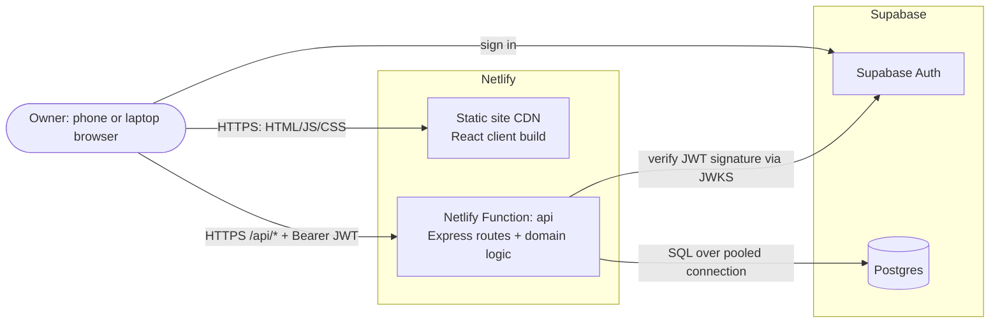
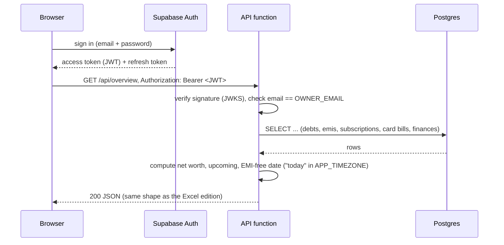

# High-Level Design: Ledger, hosted edition

**Status:** Approved, implementation in progress on the `supabase-migration` branch
**Scope:** the `main` branch only. The `personal` branch stays the local Excel + Tailscale edition.
**Companion docs:** [LLD.md](LLD.md) for low-level design, [../adr/](../adr/) for decision records.

## 1. Context

Ledger started as a local web app that reads and writes a set of Excel workbooks in place: one workbook per year for expenses, plus one each for Debts, EMI, Credit Card Bills, Subscriptions and Finances. It runs on one Windows PC as a Scheduled Task and is reached from a phone over Tailscale.

That design has one hard availability limit. The phone can only reach the PC while both have internet access. A multi-day home internet outage made the app unreachable even though the PC was on and the server was healthy.

The hosted edition removes that limit for anyone who forks `main`. It runs on managed infrastructure that's reachable from anywhere with a connection, with the same features and the same calculation rules.

## 2. Goals and non-goals

**Goals**
- Reachable from any device with internet access, with no home PC involved.
- Feature parity with the Excel edition: every tab, every computed figure, and the same API contract the client already uses.
- Self-hostable by one person on free tiers: fork the repo, create a Netlify site and a Supabase project, set a few environment variables.
- A one-time import of existing `Expenses (YYYY).xlsx` history and the other workbooks.
- Financial data never readable without the owner's login.

**Non-goals**
- Multi-user or multi-tenant hosting (see [ADR-0002](../adr/0002-self-host-single-owner.md)).
- Keeping Excel as a live storage option on `main` (see [ADR-0003](../adr/0003-replace-excel-storage-on-main.md)).
- Offline-first use. With no internet on the device, the hosted edition is unreachable too. The `personal` edition's home-network fallback covers that case.
- Real-time collaboration and push notifications.

## 3. System context

| Component | Responsibility | Technology |
|---|---|---|
| Client | All UI, the same React app as today, plus a sign-in screen | React 19 + Vite, served from Netlify's CDN |
| API function | Every `/api/*` route, input validation, all calculations (EMI balances and due dates, dashboard overview, finance summaries) | Express wrapped with `serverless-http`, deployed as a single Netlify Function |
| Auth | Owner sign-in and session tokens | Supabase Auth, with public sign-ups disabled |
| Database | Durable storage for every module | Supabase Postgres |

## 4. Key flows

### 4.1 Sign-in and an authenticated request

### 4.2 Writes

Every write is one SQL transaction. That replaces the Excel edition's per-file lock plus whole-workbook rewrite. Postgres row locks and constraints give the same guarantee the file lock used to: two simultaneous saves can't silently overwrite each other.

## 5. Deployment topology

- **One Git repo, one Netlify site.** On every push to the deploy branch, Netlify builds the client and bundles the function. `netlify.toml` routes `/api/*` to the function and every other path to the SPA's `index.html`.
- **One Supabase project per owner.** The schema lives in `supabase/migrations/` and is applied with the Supabase CLI. The same files drive the local Docker stack used in development and tests.
- **Configuration is environment variables only** (listed in [LLD §9](LLD.md#9-configuration)). No secrets in the repo.

## 6. Quality attributes

| Attribute | Approach |
|---|---|
| Availability | Managed CDN and serverless functions, no single home machine. Supabase's free tier pauses a project after about 7 days without activity. The README documents this, and the owner can upgrade if it matters. |
| Security | One owner account, public sign-ups off. Every API request needs a valid JWT for `OWNER_EMAIL`. Row Level Security is enabled with no policies on every table, so Supabase's auto-generated public Data API can read nothing. Only the API function connects, using the database role. HTTPS end to end. |
| Data integrity | Constraints (positive amounts, valid months, valid due days) enforce in the database the same rules the API validates. Every write is transactional. |
| Correctness of dates | Every "today" calculation uses an explicit `APP_TIMEZONE`, because serverless runtimes run in UTC ([ADR-0005](../adr/0005-explicit-app-timezone.md)). |
| Backups | The free tier has no point-in-time recovery. The README documents a periodic `pg_dump` and the planned Excel export. |
| Performance | Per-owner data volumes are tiny (thousands of rows). The heaviest endpoint, the finance summary since 2018, is a handful of indexed queries. |
| Cost | Netlify and Supabase free tiers. |
| Testability | Everything runs against a local Supabase stack in Docker: the server suites, e2e and screenshot scripts. Nothing touches a hosted project or the owner's live data. |

## 7. Migration strategy

The migration is incremental and every step stays testable. Each phase is committed only once its suites pass.

1. **Foundation:** schema migrations, local Supabase stack, database client and test harness.
2. **Port modules one by one:** debts, subscriptions, EMI, credit card bills, finances, categories, expenses, overview. Each module's storage moves from Excel to SQL while its tests stay green.
3. **Hosting and auth:** Netlify Function wrapper, JWT middleware, client sign-in screen, `netlify.toml`.
4. **Import:** `scripts/import-xlsx.ts` brings Excel history into a Supabase project.
5. **Wrap-up:** e2e and screenshot scripts against the local stack, then README and ARCHITECTURE rewritten for the hosted edition, then merge into `main`.

## 8. Risks

| Risk | Mitigation |
|---|---|
| Behavior drift between editions during the port | Keep the existing server tests as the parity contract. Port storage only. Calculation code moves unchanged where possible. |
| Timezone off-by-one in due dates | `APP_TIMEZONE` plus tests that pin "today" near midnight. |
| `date` and `numeric` driver conversions (JS `Date` shifting a calendar date, numbers coming back as strings) | Custom type parsers in the database client ([LLD §4.2](LLD.md#42-driver-configuration)). |
| Connection limits in serverless | Supabase's transaction pooler on port 6543, `prepare: false`, one small client per function instance. |
| Free-tier project pause | Documented, with no data loss on pause. Upgrade path noted. |
| Cherry-picks between `personal` and `main` stop applying to storage code | Expected trade-off ([ADR-0003](../adr/0003-replace-excel-storage-on-main.md)). Calculation and UI changes still port. |
